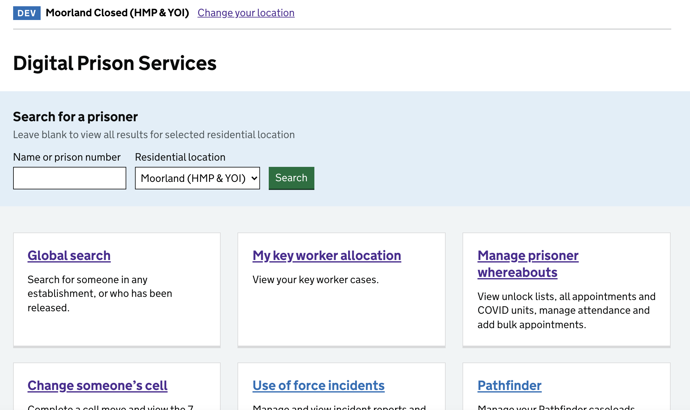
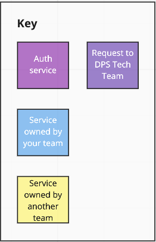
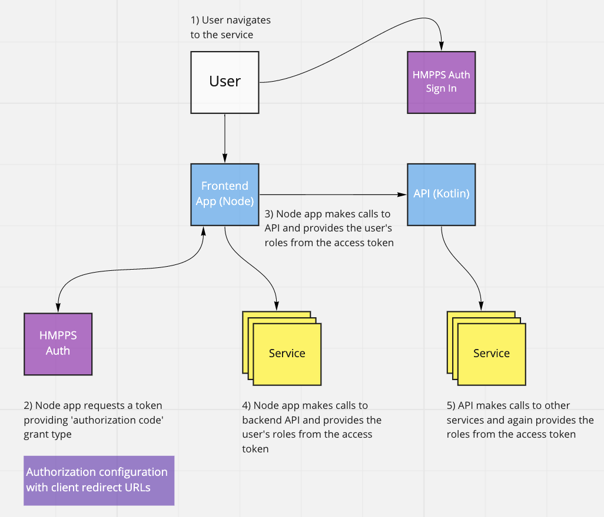
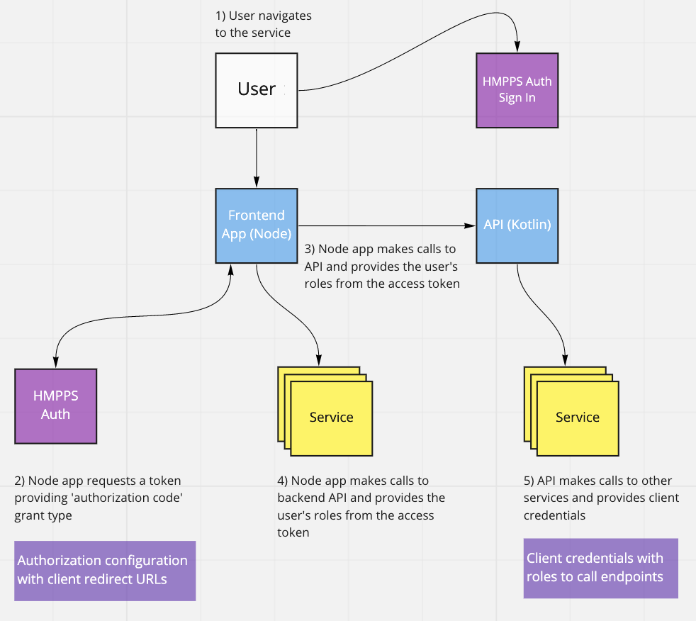
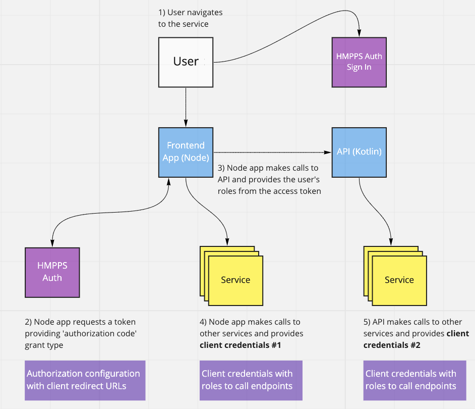

This document describes HMPPS Auth, how it can be used and what you must consider before integrating with the service.

## About HMPPS Auth
HMPPS Auth is for accessing HMPPS digital services which includes Digital Prison Services (DPS) and probation services.
This service can be used to authenticate users who need to use any of HMPPS' digital products and legacy applications, such as Delius.

#### You can use HMPPS Auth to:
- Authenticate your service so that it can access the data it needs via HMPPS APIs
- Provide users with access to your service

### Before you start
##### When you are designing your service your user research should consider:
- How will your users access your service? What kind of user accounts will they need? Do they work in prison or probation or are they external to MoJ? Do they already have NOMIS and/or Delius accounts?
- How will you provide your users with the permissions they need to access and use your service? How will these be allocated and managed?
- How will your users find your service? And how will they find out how to get help and support?
- What data and from which existing APIs will your service be using data? How will it identify and authenticate itself to be allowed to access this data?

### User accounts

To access HMPPS digital services users need to sign in and have the appropriate role(s). Roles provie permission to access services and determine what a user can do in a service.

##### Users can sign in to HMPPS Auth with a:
- Digitial Prison Services (DPS) account - this allows users to sign in with their NOMIS username and password
- Probation account - this allows users to sign in with their Delius username and password
- HMPPS Auth external accounts - for users that do not have a NOMIS or Delius account or are external to the Ministry of Justice. For example, the police or external prison training providers

Some services need to be accessed by a mixture of users. For example, a service might be used by both prison and probation staff and the police, which means users may access the service by signing in with a NOMIS, Delius or an external account.

### DPS users
Digital Prison Services (DPS) users sign in to HMPPS Auth with their NOMIS account. NOMIS is a system for managing people in prison.

#### DPS users can:
- sign in to HMPPS Auth with their NOMIS username and password
- use HMPPS Auth to reset their NOMIS password and request an email reminder of their NOMIS username
- be allocated digital prison service (DPS) roles
- can manage other DPS user accounts, providing they have the right role (permission) to do this

When designing your service you should consider whether any of your users have a NOMIS account.

While most prison staff will already have a NOMIS account some prison staff might not use NOMIS. And some prison staff that have NOMIS accounts do not use the legacy NOMIS system.

To find out how to onboard DPS users see [onboarding users](#onboarding-users).

To find out how to create NOMIS user accounts in the Auth developer environment see [Testing your service](#getting-access-to-auth-and-testing-your-service)

### Users that sign in with a DELIUS account
Delius is a probation case management system, which is mainly used by probation staff but some prison staff also have Delius accounts.

#### Delius users:
- can sign in to HMPPS Auth with a Delius username and password
- automatically have the probation role, which means they can access any digital services that are available to users with this role
- cannot be allocated additional roles
- can change their Delius password in HMPPS Auth. This new password can then be used to sign into Delius too.
- cannot change their email address in HMPPS Auth.

### Auth external accounts
- are for users that don’t have a NOMIS or Delius account or are external to the Ministry of Justice. For example, users that work for charities, education or housing providers that work with people that are in or leaving prison.
- can sign in with an email address and password
- can change their email address and password
- can be allocated an external role(s)
- can be added to a group
- can manage groups, providing they have the right role (permission) to do this
- can manage other external users, providing they have the right role (permission) to do this

#### External accounts are not suitable for users that have:
- A Delius account
- A NOMIS account

We have a hierarchy of external users to make the administration of user accounts simpler.  Group managers can be created by application support that are then responsible for creating and managing users within their own group.

#### To add a new type of user we would normally suggest:
- Add a new group (or set of groups) for the new users
- Identify support staff that would be able to administer the users, create accounts for them (if necessary) and give them management privileges within those groups

We have scripts for bulk creation of groups and users if required, please contact the tech team for future information.

### Users that have multiple accounts
Some users have both a NOMIS and a Delius account. This means that some users can see and access different digital services depending on which account they sign into HMPPS Auth with. For example, a user that signs into HMPPS Auth with their Delius account will only see services that are available to Delius users, even if these services are also available to NOMIS and external users. To access services that are only available to NOMIS users they will need to sign in to HMPPS Auth with their NOMIS account.

We are working on improving the user journeys for users that have multiple accounts.

## Creating, allocating and managing user permissions
##### The digital services that users can access with HMPPS Auth, and what they can do in those services, is determined by:
- Which roles have been allocated to their account(s)
- Which groups they belong to

### Groups and Roles
Roles and groups provide permission to access services and determine what a user can do in a service.

- Roles: can be allocated to all types of users
- Groups: only external users can be added to and manage groups

To provide access to your service it will need at least one role even if the service also has groups.

### Creating and managing groups
Content coming soon.

### Creating and allocating roles

Roles are a way to assign permissions to your users. For example, your service might have a role that allows users to suggest changes to an offender’s record and another role to approve those changes.

##### Different types of roles can be allocated to different types of account:
- DPS roles can be allocated to DPS users - people who sign in with a NOMIS username and password
- Probation users (people who sign in with a DELIUS username and password) will automatically have the probation role.
- External account users can be allocated to external users.

##### Before creating roles for your service you should consider:
- Who are your users and how will they access your service?
- Do they have a NOMIS and/or a Delius account?
- Will your service be used by people outside of Ministry of Justice? For example, the police or external training providers.

#### DPS (NOMIS) user roles
Content coming soon.
_How to create a role, how the roles will be allocated to users_

#### External user roles
Content coming soon.
_How to create a role, how the roles will be allocated to users_

#### Using the Delius probation role
Content coming soon.

### Giving your users multiple roles
You might need to provide some of your users with more than one role in your service. For example, a manager may need to both suggest and approve decisions in a service.

Users can be allocated as many roles as they need but you should consider how your users will switch between roles in your service. For example, the Digital Categorisation service allows users with multiple roles to select which role they want to use from a menu at the top of the page.

## Onboarding users
Content coming soon.

## Helping users to find your service
HMPPS Auth provides users with access to a variety of digital services. This makes it easy for users to find everything they need from a single place.

#### Users can access HMPPS digital services by:
- Visiting the HMPPS Auth sign-in page and signing in
- Clicking on the DPS desktop icon - this is available on most of the computers that prison staff use.

When users are signed in to HMPPS Auth all of the services they have permission to access will be displayed as service tiles.

The landing page that users see after signing in at the HMPPS Auth sign in page:

The Digital Prison Services homepage that users in prisons see after clicking on the ‘DPS’ desktop icon. This can also be accessed from the Digital Prison Services tile on the Auth landing page (shown above).

### Create a service tile:
To identify where you service tile should appear we need to know:
- Will your service only be accessed by prison staff? If yes, the service tile will be added to the Digital Prison Services homepage.
- Will your service be accessed by any users that sign in with an external Auth account and/or a Delius account?

To create a service tile you need to provide the following information about your service:

- **Service name**: this will be displayed on the tile e.g Book a secure move
- **Service description**: a short description that will be displayed on the tile e.g Allocate the appropriate offender manager to a prisoner
- **Roles**: the role(s) users must have to be able to see the tile
- **Url / email**: the url of the service i.e where it should take the user once they have clicked on the tile
- **Help email**: we need a contact email address for any enquiries from your service users about logging in or accessing your service. Some teams set up a generic inbox for this.

Before a tile is created you must also have a way your users to give feedback and get support with your service. We recommend adding your service to https://support-dev.hmpps.service.justice.gov.uk/feedback-and-support

## Getting access to Auth and testing your service

HMPPS Auth has three environments:

- Prod - this is the environment your users will access your live service in. Access to production is restricted as it includes real data about people in prison.
- Preprod - this environment is a copy of the prod environment. Every two weeks preprod will be overwritten to match the prod environment.
- Dev (T3) - this environment is for testing and does not include any real data about people in prison.

### Requesting Tokens
 - We have put together diagrams below to provide information about tokens in HMPPS Auth. It should help explain the types of tokens which need to be requested from the DPS Tech Team.
 - We have covered a number of scenarios which describe typical shape of applications, their stack, interactions with Auth and other services.
 - There are a few concepts which influence the grant types to request:
  - **User roles**
     - Roles which can be assigned to a user or an API
  - **System roles**
     - Roles which should not be assigned to users and they are provided to systems for talking to other APIs. For example `ROLE_COMMUNITY`
  - **Controlled roles**
     - Endpoints protected by roles which are controlled because they require additional approval before they can be added to a client credential. For example `ROLE_GLOBAL_SEARCH`

This section does not discuss how to appropriately protect _your_ endpoints with roles.

#### Scenario 1
When your services makes calls to services which are authenticated with **user roles**. You can use grant type of _Authorization Code_

#### Scenario 2
When your API makes calls to services which are authenticated with **system or controlled roles**.

#### Scenario 3
When both your frontend and API make calls to services which are authenticated with **system or controlled roles**.

### Client credentials
Content coming soon.

### Creating test user accounts
Content coming soon.